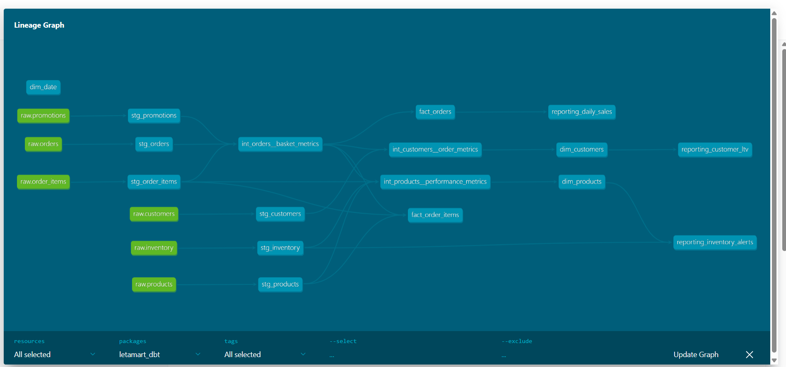

# letamart_dbt

> **An end-to-end analytics engineering portfolio project** built on dbt + BigQuery, modelling an online supermarket from raw transactional data through to BI-ready facts, dimensions and reporting tables — with automated testing, documentation, Slack alerts and scheduled GitHub Actions pipelines.

**Author:** Nehemiah Onyinge
**Stack:** dbt 1.11 · BigQuery · Python · GitHub Actions · Slack
**Repo:** https://github.com/NEHEMIAH2674/letamart_data

---

## Table of Contents

1. [Problem Statement](#1-problem-statement)
2. [Solution Architecture](#2-solution-architecture)
3. [Project Structure](#3-project-structure)
4. [Setup Guide](#4-setup-guide)
   - [4.1 Prerequisites](#41-prerequisites)
   - [4.2 GCP Configuration](#42-gcp-configuration)
   - [4.3 Python Environment](#43-python-environment)
   - [4.4 dbt Setup](#44-dbt-setup)
   - [4.5 BigQuery Connection](#45-bigquery-connection)
5. [Data Generation](#5-data-generation)
6. [dbt Layers](#6-dbt-layers)
   - [6.1 Sources](#61-sources)
   - [6.2 Staging](#62-staging)
   - [6.3 Intermediate](#63-intermediate)
   - [6.4 Analytics — Facts](#64-analytics--facts)
   - [6.5 Analytics — Dimensions](#65-analytics--dimensions)
   - [6.6 Analytics — Reporting](#66-analytics--reporting)
7. [Custom Macros](#7-custom-macros)
8. [Testing Strategy](#8-testing-strategy)
9. [Documentation](#9-documentation)
10. [Scheduling & Orchestration](#10-scheduling--orchestration)
11. [Slack Alerts](#11-slack-alerts)
12. [Key Design Decisions](#12-key-design-decisions)

---

## 1. Problem Statement

An online supermarket generates transactional data across orders, products, customers, inventory and promotions. This data lands in BigQuery as raw tables with inconsistent types, no business logic and no documentation.

**The challenge:**
- Raw data has no consistent naming or typing conventions
- Business analysts can't answer questions like "What is our customer LTV by cohort?" or "Which products are below reorder point?" without complex ad-hoc SQL
- There is no data quality monitoring — bad data goes undetected
- There is no scheduled pipeline — everything is manual

**The solution:**
A fully automated dbt pipeline that transforms raw data into clean, tested, documented and BI-ready tables — with Slack alerts, hourly incremental updates and daily full refreshes scheduled via GitHub Actions.

---

## 2. Solution Architecture

```
┌─────────────────────────────────────────────────────────────────────┐
│                         DATA FLOW                                    │
│                                                                      │
│  Python script          dbt pipeline             BI / Alerts        │
│  (daily 12:00)                                                       │
│                                                                      │
│  generate_raw_data.py                                                │
│       │                                                              │
│       ▼                                                              │
│  BigQuery                                                            │
│  letamart_raw          ┌──────────┐                                  │
│  ┌──────────┐          │ staging  │  views                           │
│  │ orders   │ ────────▶│ stg_*    │                                  │
│  │ items    │          └────┬─────┘                                  │
│  │ products │               │                                        │
│  │ customers│          ┌────▼──────────┐                             │
│  │ inventory│          │ intermediate  │  ephemeral                  │
│  │ promos   │          │ int_*         │                             │
│  └──────────┘          └────┬──────────┘                            │
│                              │                                       │
│                    ┌─────────▼──────────────────┐                   │
│                    │      analytics              │                   │
│                    │  facts/    (incremental)    │                   │
│                    │  dimensions/ (full refresh) │                   │
│                    │  reporting/  (full refresh) │                   │
│                    └─────────┬──────────────────┘                   │
│                              │                                       │
│                    ┌─────────▼──────────────────┐                   │
│                    │   Looker / Metabase / BI    │                   │
│                    │   Slack inventory alerts    │                   │
│                    └────────────────────────────┘                   │
└─────────────────────────────────────────────────────────────────────┘
```

### Lineage Graph (dbt docs)

> Run `dbt docs generate && dbt docs serve` to view the interactive lineage graph at http://localhost:8080



### Layer Responsibilities

| Layer | Materialisation | Responsibility |
|---|---|---|
| `staging` | view | Rename, cast, light cleaning. One model per source table. No joins, no business logic. |
| `intermediate` | ephemeral | Business logic, joins, derived metrics. No storage cost — compiled inline. |
| `analytics/facts` | incremental (merge) | Order and line-item facts. Partitioned by `order_date`, clustered for query efficiency. |
| `analytics/dimensions` | table | Customer 360, product catalogue, date spine. SCD Type 1. |
| `analytics/reporting` | table | Pre-aggregated summaries for dashboards and Slack alerts. |

---

## 3. Project Structure

```
letamart_dbt/
├── models/
│   ├── staging/
│   │   └── letamart_raw/
│   │       ├── column_docs/       # reusable column descriptions
│   │       ├── model_docs/        # model descriptions
│   │       ├── src_letamart.yml   # source definitions + freshness + tests
│   │       ├── stg_models.yml     # staging model tests + doc references
│   │       ├── stg_orders.sql
│   │       ├── stg_order_items.sql
│   │       ├── stg_products.sql
│   │       ├── stg_customers.sql
│   │       ├── stg_inventory.sql
│   │       └── stg_promotions.sql
│   ├── intermediate/
│   │   ├── column_docs/
│   │   ├── model_docs/
│   │   ├── int_models.yml
│   │   ├── int_orders__basket_metrics.sql
│   │   ├── int_customers__order_metrics.sql
│   │   └── int_products__performance_metrics.sql
│   └── analytics/
│       ├── column_docs/
│       ├── model_docs/
│       ├── analytics_models.yml
│       ├── facts/
│       │   ├── fact_orders.sql
│       │   └── fact_order_items.sql
│       ├── dimensions/
│       │   ├── dim_customers.sql
│       │   ├── dim_products.sql
│       │   └── dim_date.sql
│       └── reporting/
│           ├── reporting_daily_sales.sql
│           ├── reporting_inventory_alerts.sql
│           └── reporting_customer_ltv.sql
├── macros/
│   ├── README.md
│   ├── limit_data_in_dev.sql
│   ├── generate_surrogate_key.sql
│   ├── cents_to_pounds.sql
│   ├── is_valid_email.sql
│   ├── get_revenue_metrics.sql
│   ├── safe_divide.sql
│   └── current_timestamp_utc.sql
├── scripts/
│   ├── generate_raw_data.py       # generates realistic supermarket data → BigQuery
│   └── slack_alert.py             # sends run results + inventory alerts to Slack
├── .github/workflows/
│   ├── dbt_ci.yml                 # PR check: compile + source tests
│   ├── dbt_hourly.yml             # hourly incremental fact refresh
│   └── dbt_daily.yml              # daily full run + docs + Slack alerts
├── .sqlfluff                      # SQL linting rules
├── .pre-commit-config.yaml        # pre-commit hooks (SQLFluff + file checks)
├── dbt_project.yml                # dbt project configuration
├── packages.yml                   # dbt packages (dbt_utils)
├── profiles.yml                   # BigQuery connection profiles
└── requirements.txt               # Python dependencies
```

---

## 4. Setup Guide

### 4.1 Prerequisites

- Python 3.11+
- Google Cloud SDK (`gcloud`)
- Git + GitHub account
- A personal GCP project with BigQuery enabled
- A Slack workspace with incoming webhooks enabled

### 4.2 GCP Configuration

This project uses a **separate gcloud configuration** to isolate the personal GCP account from any existing org accounts on the same machine.

```bash
# Check which account is currently active
gcloud config get-value account

# Create a new isolated configuration for this project
gcloud config configurations create letamart

# Log in with your personal Google account
gcloud auth login

# Point the configuration at your GCP project
gcloud config set project YOUR_PROJECT_ID

# Set up Application Default Credentials (used by dbt to authenticate)
gcloud auth application-default login

# Enable required APIs
gcloud services enable bigquery.googleapis.com --project=YOUR_PROJECT_ID
gcloud services enable iamcredentials.googleapis.com --project=YOUR_PROJECT_ID

# Confirm your configuration
gcloud config configurations list
```

**Expected output:**
```
NAME       IS_ACTIVE  ACCOUNT                    PROJECT
letamart   True       your@gmail.com             your-project-id
work       False      work@organization.com      org-project-id
```

> **Why a separate configuration?**
> Running `gcloud config configurations activate work` switches back to your org account instantly. The two projects never interfere with each other.

### 4.3 Python Environment

```bash
# Clone the repo
git clone https://github.com/NEHEMIAH2674/letamart_data.git
cd letamart_data

# Create virtual environment at the parent level
# (covers both dbt project and any future API/scripts subfolder)
python -m venv venv
source venv/Scripts/activate   # Windows Git Bash
# source venv/bin/activate      # macOS/Linux

# Install all dependencies
cd letamart_dbt
pip install -r requirements.txt
```

### 4.4 dbt Setup

```bash
# Install dbt packages (dbt_utils)
dbt deps

# Validate the connection
dbt debug
```

**Expected output:**
```
profiles.yml file [OK found and valid]
dbt_project.yml file [OK found and valid]
Connection test: [OK connection ok]
All checks passed!
```

### 4.5 BigQuery Connection

The `profiles.yml` in the repo root contains two targets:

```yaml
letamart_dbt:
  target: dev
  outputs:
    dev:
      type: bigquery
      method: oauth          # uses gcloud ADC — no key files
      project: npd-01
      dataset: letamart_dev
      location: EU
      threads: 4

    prod:
      type: bigquery
      method: oauth
      project: npd-01
      dataset: letamart_prod
      location: EU
      threads: 8
```

> **Security note:** `method: oauth` uses Application Default Credentials — no service account key files are stored in the repo. GitHub Actions uses Workload Identity Federation for keyless authentication.

---

## 5. Data Generation

The project includes a Python script that generates realistic supermarket data and loads it into BigQuery. This makes the project fully self-contained — no external data sources required.

```bash
# Set environment variables (create a .env file — never committed)
GCP_PROJECT_ID=your-project-id
GCP_DATASET_ID=letamart_raw
GCP_LOCATION=EU
SLACK_WEBHOOK_URL=https://hooks.slack.com/services/...

# Run the generator
python scripts/generate_raw_data.py
```

**Generated tables:**

| Table | Rows | Description |
|---|---|---|
| `products` | 100 | Product catalogue across 10 categories |
| `customers` | 500 | Registered customers with loyalty tiers |
| `promotions` | 20 | Discount campaigns |
| `orders` | 3,000 | Customer orders with status and channel |
| `order_items` | ~19,000 | Line items per order |
| `inventory` | 400 | Daily stock snapshots across 4 warehouses |

The script sends a Slack alert on completion with row counts and elapsed time.

---

## 6. dbt Layers

### 6.1 Sources

Defined in `models/staging/letamart_raw/src_letamart.yml`.

Sources tell dbt where to find raw data in BigQuery and define:
- Database and schema (`npd-01.letamart_raw`)
- Data freshness thresholds (warn after 25h, error after 48h)
- Column-level tests on the raw tables

### 6.2 Staging

**Materialisation:** view | **Models:** 6 | **Tests:** 58

Staging models are the first transformation layer. They follow strict rules:
- One model per source table
- Cast all columns to correct types
- Rename columns to consistent conventions
- Add light derived columns (e.g. `line_total_gbp`, `is_substituted`)
- Add `refreshed_at` audit column
- **No joins, no business logic**

```sql
-- Example: stg_orders.sql
with source as (
    select * from {{ source('raw', 'orders') }}
),

orders as (
    select
        cast(order_id   as string)    as order_id,
        cast(customer_id as string)   as customer_id,
        lower(trim(status))           as order_status,
        lower(trim(channel))          as order_channel,
        cast(created_at as timestamp) as order_created_at,
        cast(_loaded_at as timestamp) as refreshed_at
    from source
)

select * from orders
```

### 6.3 Intermediate

**Materialisation:** ephemeral | **Models:** 3 | **Tests:** 9

Intermediate models contain all business logic. They are ephemeral — no BigQuery tables are created. The SQL is compiled inline by downstream models, saving storage cost.

| Model | What it does |
|---|---|
| `int_orders__basket_metrics` | Joins orders + items + promotions. Calculates basket value, discount, substitution count. |
| `int_customers__order_metrics` | Aggregates to customer grain. LTV, average order value, RFM segmentation. |
| `int_products__performance_metrics` | Aggregates to product grain. Revenue, margin, units sold, inventory status. |

**Naming convention:** `int_{entity}__{transformation}` — double underscore separates entity from transformation verb.

### 6.4 Analytics — Facts

**Materialisation:** incremental (merge) | **Partition:** `order_date` | **Cluster:** `order_status`, `order_channel`

Fact tables use an incremental merge strategy — only the last 3 days are processed on each run, dramatically reducing BigQuery compute costs.

```sql

    where order_date >= date_sub(current_date(), interval 3 day)

```

| Model | Rows | Grain |
|---|---|---|
| `fact_orders` | ~3,000 | One row per order |
| `fact_order_items` | ~19,000 | One row per order line |

### 6.5 Analytics — Dimensions

**Materialisation:** table (SCD Type 1 — full refresh daily)

| Model | Rows | Description |
|---|---|---|
| `dim_customers` | 500 | Customer 360 with LTV, RFM segment (`active`, `at_risk`, `lapsing`, `churned`) and value band (`high`, `mid`, `low`) |
| `dim_products` | 100 | Product catalogue with gross margin %, performance tier (`hero`, `core`, `tail`) and inventory status |
| `dim_date` | 2,000+ | Date spine from 2023 to 2 years ahead with week/month/quarter labels |

### 6.6 Analytics — Reporting

**Materialisation:** table (full refresh daily)

Pre-aggregated tables built specifically for BI tools and Slack alerts.

| Model | Description |
|---|---|
| `reporting_daily_sales` | Daily revenue by channel with WoW % change and 7-day rolling revenue |
| `reporting_inventory_alerts` | Products below reorder point classified as `out_of_stock`, `critical` or `low_stock` |
| `reporting_customer_ltv` | Monthly cohort LTV, retention rates (`pct_active_30d`, `pct_active_90d`) |

---

## 7. Custom Macros

Located in `macros/`. See `macros/README.md` for full documentation.

| Macro | Usage | Purpose |
|---|---|---|
| `limit_data_in_dev(date_col, days)` | `{{ limit_data_in_dev('order_created_at', 90) }}` | Adds WHERE clause in dev only — reduces cost |
| `generate_surrogate_key(fields)` | `{{ generate_surrogate_key(['order_id']) }}` | Consistent surrogate key hashing |
| `cents_to_pounds(col)` | `{{ cents_to_pounds('price_pence') }}` | Integer pence → decimal GBP |
| `is_valid_email(col)` | `{{ is_valid_email('email') }}` | Regex email validation |
| `get_revenue_metrics(gross, discount)` | `{{ get_revenue_metrics('basket_value_gbp', 'discount_gbp') }}` | Reusable revenue aggregation |
| `safe_divide(num, denom)` | `{{ safe_divide('revenue', 'orders') }}` | Null-safe division |
| `current_timestamp_utc()` | `{{ current_timestamp_utc() }}` | Consistent UTC timestamps |

---

## 8. Testing Strategy

Tests are defined in YAML files alongside each model. dbt runs them with `dbt test`.

**Test types used:**
- `unique` — no duplicate primary keys
- `not_null` — required columns are always populated
- `accepted_values` — categorical columns only contain expected values
- `relationships` — foreign keys reference valid records in parent tables

**Test counts by layer:**

| Layer | Models | Tests |
|---|---|---|
| Sources (raw) | 6 | 30 |
| Staging | 6 | 58 |
| Intermediate | 3 | 9 |
| Analytics | 8 | 30 |
| **Total** | **23** | **127** |

```bash
# Run all tests
dbt test

# Run tests for a specific layer
dbt test --select staging
dbt test --select intermediate
dbt test --select analytics
```

---

## 9. Documentation

dbt generates an interactive documentation site from the descriptions and tests defined in YAML files.

```bash
# Generate the catalog
dbt docs generate

# Serve locally at http://localhost:8080
dbt docs serve
```

**What you'll see:**
- **Lineage graph** — full DAG from sources to reporting models
- **Model pages** — description, columns, tests, SQL code
- **Source pages** — freshness status, raw table schema
- **Macro pages** — usage and description

Every model, column and source in this project has a written description. Column descriptions are defined once in `column_docs/` markdown files and referenced across multiple models using `{{ doc('column_name') }}`.

---

## 10. Scheduling & Orchestration

Three GitHub Actions workflows automate the full pipeline:

### dbt CI (`dbt_ci.yml`) — triggered on every PR to main
1. Authenticate to GCP via Workload Identity Federation
2. Install dbt + packages
3. Compile all SQL (catches syntax errors before they reach BigQuery)
4. Run source freshness tests
5. Post pass/fail comment on the PR

### Hourly run (`dbt_hourly.yml`) — every hour at :00
1. Authenticate to GCP
2. Check source freshness
3. Run `tag:incremental` models only (fact tables — last 3 days)
4. Test incremental models
5. Send Slack alert with pass/fail summary

### Daily full run (`dbt_daily.yml`) — 12:00 UTC every day
1. Authenticate to GCP
2. Check source freshness
3. Run all models in dependency order
4. Run all 127 tests
5. Generate dbt docs (uploaded as GitHub Actions artifact)
6. Send inventory Slack alert (out-of-stock and critical products)
7. Send run summary Slack alert
8. On failure: send critical failure alert with link to failed run

### GitHub Actions Secrets Required

| Secret | Description |
|---|---|
| `GCP_WORKLOAD_IDENTITY_PROVIDER` | WIF provider resource name |
| `GCP_SERVICE_ACCOUNT` | Service account email |
| `GCP_PROJECT_ID` | BigQuery project ID |
| `GCP_DATASET_ID` | Raw dataset ID |
| `GCP_LOCATION` | BigQuery location (EU/US) |
| `SLACK_WEBHOOK_URL` | Slack incoming webhook URL |

---

## 11. Slack Alerts

Two alert types are sent to Slack:

### Run summary alert
Sent after every hourly and daily run. Shows pass/fail counts, elapsed time and failed model names.

```
✅ letamart_dbt — daily run Passed
Models run: 17 | Passed: 17 | Errors: 0
Elapsed: 45s | 2026-05-31 12:00 UTC
```

### Inventory alert
Sent daily with products below reorder point, prioritised by severity:

```
📦 Inventory Alert
🔴 Whole Milk — OUT OF STOCK (dairy | WH-LONDON-01)
🟠 Chicken Breast — CRITICAL (2 units left)
🟡 Sourdough Loaf — low stock (8 units)
```

---

## 12. Key Design Decisions

| Decision | Reason |
|---|---|
| **Separate gcloud configuration** | Personal project never touches the org BigQuery instance |
| **ADC over service account keys** | No key files to accidentally commit to GitHub |
| **Ephemeral intermediate models** | Zero BigQuery storage cost for business logic layer |
| **Incremental merge on facts** | Processes only last 3 days — reduces compute cost by ~95% vs full refresh |
| **Partitioned + clustered fact tables** | Partition pruning and clustering reduce query costs for BI tools |
| **SQLFluff pre-commit hooks** | Consistent SQL style enforced before every commit — no manual review needed |
| **Workload Identity Federation** | Keyless GCP auth from GitHub Actions — no secrets rotation needed |
| **`ON` joins over `USING`** | Explicit join conditions are unambiguous and easier to debug |
| **Column docs in separate `.md` files** | Write once, reference everywhere — single source of truth for column descriptions |
| **`refreshed_at` audit column** | Every staging model tracks when data was last loaded — enables data freshness monitoring |
